# **Praktikum 4 Jaringan Komputer**
<div align=justify>

Berikut adalah Repository dari Kelompok A17 untuk pengerjaan Praktikum Modul 4 Jaringan Komputer. Dalam Repository ini terdapat Anggota Kelompok, Dokumentasi serta Penjelasan tiap soal, Screenshot Output, dan Kendala yang dialami.

# **Anggota Kelompok**

| Nama                      | NRP        | Kelas                |
| ------------------------- | ---------- | ----------------     |
| Andrian                   | 5025211079 | Jaringan Komputer A  |
| Akmal Ariq Romadhon       | 5025211188 | Jaringan Komputer A  |


# **Dokumentasi dan Penjelasan Soal**
<div align=justify>

Berikut adalah dokumentasi yang berisi source code dari tiap soal dan penjelasan terkait perintah atau _syntax_ yang digunakan. 

## **Soal Praktikum 4**


- Soal shift dikerjakan pada Cisco Packet Tracer dan GNS3 menggunakan metode perhitungan CLASSLESS yang berbeda.
Keterangan: Bila di CPT menggunakan VLSM, maka di GNS3 menggunakan CIDR atau sebaliknya

- Jika tidak ada pemberitahuan revisi soal dari asisten, berarti semua soal BERSIFAT BENAR dan DAPAT DIKERJAKAN.

- Untuk di GNS3 CLOUD merupakan NAT1 jangan sampai salah agar bisa terkoneksi internet.

- Pembagian IP menggunakan Prefix IP yang telah ditentukan pada modul pengenalan.

- Pembagian IP dan routing harus SE-EFISIEN MUNGKIN.
Gambar topologi yang lebih jelas dapat diakses pada link [berikut](https://drive.google.com/file/d/1VmJXOyEoWru1tfXISOgoJiPfE1hpbptM/view)

# **Penamaan Subnetting**
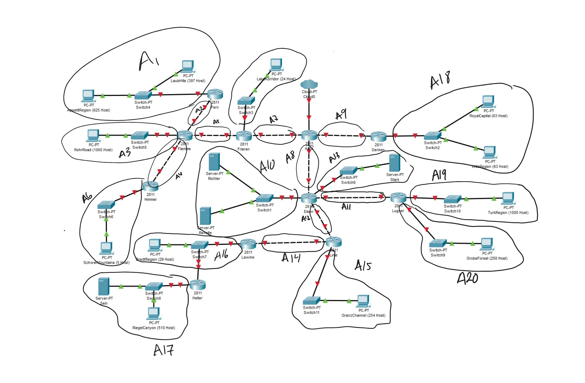

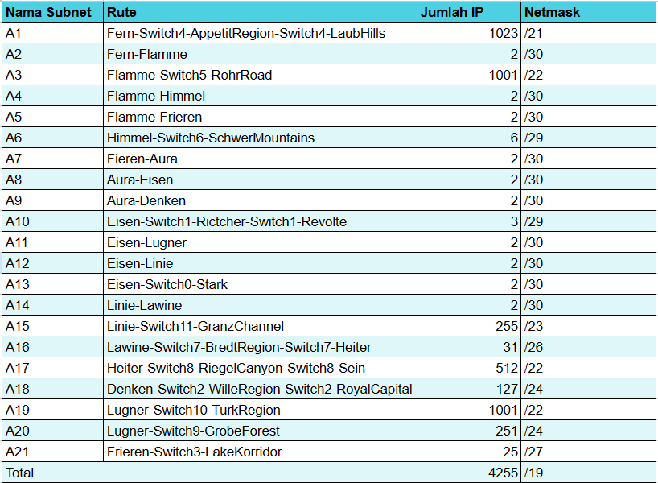


# **VLSM**
Berikut adalah langkah-langkah pengerjaan untuk pengerjaan praktikum dengan metode VLSM.

## **_Subnetting_**
_Subnetting_ merupakan cara untuk mengelola jaringan dari jaringan yang lebih besar. Dengan adanya subnet, kita dapat melakukan manajemen suatu jaringan dengan lebih baik. Berikut adalah hasil _subnetting_ dari kelompok kami:

 


Untuk detail terkait _subnetting_ dapat diakses  [disini](https://docs.google.com/spreadsheets/d/1g9e3pyLJarNEssHcELBahROomv_jLfQm5B9F5-5FD4Q/edit?usp=sharing) atau melalui link berikut: https://its.id/m/SubnettingA17

## **Pembuatan _Tree_**
Setelah melakukan _subnetting_, langkah yang digunakan adalah membuat _tree_. _Tree_ tersebut akan digunakan sebagai dasar _routing_. Berikut adalah tree hasil pengerjaan dari kelompok kami:


## **_Routing_**
Langkah terakhir untuk menyelesaikan soal dengan metode VLSM adalah melakukan _routing_. Secara singkat, _routing_ adalah cara untuk menghubungkan setiap router sehingga setiap _client_ dapat terhubung dengan _client_ yang lain. Berikut adalah _config_ dari seluruh _router_ untuk _routing_ dengan GNS3:

- **Aura**
```bash
#A9
auto eth1
iface eth1 inet static
	address 192.177.24.133
	netmask 255.255.255.252

#A7
auto eth2
iface eth2 inet static
	address 192.177.24.125
	netmask 255.255.255.252

#A8
auto eth3
iface eth3 inet static
	address 192.177.24.129
	netmask 255.255.255.252

#For Denken
up route add -net 192.177.22.0 netmask 255.255.255.0 gw 192.177.24.134

#For Fieren
up route add -net 192.177.24.112 netmask 255.255.255.252 gw 192.177.24.126
up route add -net 192.177.24.116 netmask 255.255.255.252 gw 192.177.24.126
up route add -net 192.177.8.0 netmask 255.255.252.0 gw 192.177.24.126
up route add -net 192.177.24.96 netmask 255.255.255.248 gw 192.177.24.126
up route add -net 192.177.0.0 netmask 255.255.248.0 gw 192.177.24.126
up route add -net 192.177.24.120 netmask 255.255.255.252 gw 192.177.24.126

#For Eisen
up route add -net 192.177.24.144 netmask 255.255.255.252 gw 192.177.24.130
up route add -net 192.177.24.104 netmask 255.255.255.248 gw 192.177.24.130
up route add -net 192.177.24.136 netmask 255.255.255.252 gw 192.177.24.130
up route add -net 192.177.24.140 netmask 255.255.255.252 gw 192.177.24.130
up route add -net 192.177.16.0 netmask 255.255.252.0 gw 192.177.24.130
up route add -net 192.177.23.0 netmask 255.255.255.0 gw 192.177.24.130
up route add -net 192.177.20.0 netmask 255.255.254.0 gw 192.177.24.130
up route add -net 192.177.24.148 netmask 255.255.255.252 gw 192.177.24.130
up route add -net 192.177.24.0 netmask 255.255.255.192 gw 192.177.24.130
up route add -net 192.177.12.0 netmask 255.255.252.0 gw 192.177.24.130

```

- **Denken**
```Bash
#A9
# Static config for eth0
auto eth0
iface eth0 inet static
	address 192.177.24.134
	netmask 255.255.255.252
	gateway 192.177.24.133
#	up echo nameserver 192.168.0.1 > /etc/resolv.conf

#A18
# Static config for eth1
auto eth1
iface eth1 inet static
	address 192.177.22.1
        netmask 255.255.255.0
#	gateway 192.168.1.1
#	up echo nameserver 192.168.1.1 > /etc/resolv.conf
```

- **Frieren**
```bash
#A7
# Static config for eth0
auto eth0
iface eth0 inet static
	address 192.177.24.126
	netmask 255.255.255.252
	gateway 192.177.24.125

#A21
# Static config for eth1
auto eth1
iface eth1 inet static
	address 192.177.24.66
	netmask 255.255.255.224
#	gateway 192.168.1.1

#A5
Static config for eth2
auto eth2
iface eth2 inet static
	address 192.177.24.122
	netmask 255.255.255.252
#	gateway 192.168.2.1
#	up echo nameserver 192.168.2.1 > /etc/resolv.conf

up route add -net 192.177.24.112 netmask 255.255.255.252 gw 192.177.24.121
up route add -net 192.177.24.116 netmask 255.255.255.252 gw 192.177.24.121
up route add -net 192.177.8.0 netmask 255.255.252.0 gw 192.177.24.121
up route add -net 192.177.24.96 netmask 255.255.255.248 gw 192.177.24.121
up route add -net 192.177.0.0 netmask 255.255.248.0 gw 192.177.24.121
```

- **Flamme**
```bash
#A5
# Static config for eth0
auto eth0
iface eth0 inet static
	address 192.177.24.121
	netmask 255.255.255.252
	gateway 192.177.24.122

#A2
# Static config for eth1
auto eth1
iface eth1 inet static
	address 192.177.24.114
	netmask 255.255.255.252
#	gateway 192.168.1.1

#A3
# Static config for eth2
auto eth2
iface eth2 inet static
	address 192.177.8.1
	netmask 255.255.252.0
#	gateway 192.168.2.1

#A4
# Static config for eth3
auto eth3
iface eth3 inet static
	address 192.177.24.117
	netmask 255.255.255.252
#	gateway 192.168.3.1

up route add -net 192.177.0.0 netmask 255.255.248.0 gw 192.177.24.113
up route add -net 192.177.24.96 netmask 255.255.255.248 gw 192.177.24.118

```

- **Himmel**
```bash
#A4
# Static config for eth0
auto eth0
iface eth0 inet static
	address 192.177.24.118
	netmask 255.255.255.252
	gateway 192.177.24.117
#	up echo nameserver 192.168.0.1 > /etc/resolv.conf

#A6
# Static config for eth1
auto eth1
iface eth1 inet static
	address 192.177.24.97
	netmask 255.255.255.248
#	gateway 192.168.1.1
#	up echo nameserver 192.168.1.1 > /etc/resolv.conf
```

- **Eisen**
```bash
#A8
auto eth0
iface eth0 inet static
	address 192.177.24.130
	netmask 255.255.255.252
	gateway 192.177.24.129

#A10
auto eth1
iface eth1 inet static
	address 192.177.24.105
	netmask 255.255.255.248

#A11
auto eth2
iface eth2 inet static
	address 192.177.24.137
	netmask 255.255.255.252

#A13
auto eth3
iface eth3 inet static
	address 192.177.24.145
	netmask 255.255.255.252

#A12
auto eth4
iface eth4 inet static
	address 192.177.24.141
	netmask 255.255.255.252

#Eisen-TurkRegion
up route add -net 192.177.16.0 netmask 255.255.252.0 gw 192.177.24.138

#Eisen-GrobeForest
up route add -net 192.177.23.0 netmask 255.255.255.0 gw 192.177.24.138

#LinieGranzChannel
up route add -net 192.177.20.0 netmask 255.255.254.0 gw 192.177.24.142

#LinieLawine
up route add -net 192.177.24.148 netmask 255.255.255.252 gw 192.177.24.142

#LawineBredtRegion
up route add -net 192.177.24.0 netmask 255.255.255.192 gw 192.177.24.142

#HeiterSeinRiegel
up route add -net 192.177.12.0 netmask 255.255.252.0 gw 192.177.24.142
```

- **Lugner**
```bash
#A11
auto eth0
iface eth0 inet static
	address 192.177.24.138
	netmask 255.255.255.252
	gateway 192.177.24.137

#A19
auto eth1
iface eth1 inet static
	address 192.177.16.1
	netmask 255.255.252.0

#A20
auto eth2
iface eth2 inet static
	address 192.177.23.1
	netmask 255.255.255.0
```

- **Linie**
```bash
#A12
auto eth0
iface eth0 inet static
	address 192.177.24.142
	netmask 255.255.255.252
	gateway 192.177.24.141

#A14
auto eth1
iface eth1 inet static
	address 192.177.24.149
	netmask 255.255.255.252

#A15
auto eth2
iface eth2 inet static
	address 192.177.20.1
	netmask 255.255.254.0

up route add -net 192.177.12.0 netmask 255.255.252.0 gw 192.177.24.150
up route add -net 192.177.24.0 netmask 255.255.255.192 gw 192.177.24.150
```

- **Lawine**
```bash
#A14
auto eth0
iface eth0 inet static
	address 192.177.24.150
	netmask 255.255.255.252
    gateway 192.177.24.149

#A16
auto eth1
iface eth1 inet static
	address 192.177.24.1
	netmask 255.255.255.192

up route add -net 192.177.12.0 netmask 255.255.252.0 gw 192.177.24.2
```

- **Heiter**
```bash
#A16
auto eth0
iface eth0 inet static
	address 192.177.24.2
	netmask 255.255.255.192
	gateway 192.177.24.1

#A17
auto eth1
iface eth1 inet static
	address 192.177.12.1
	netmask 255.255.252.0
```
Kongfigurasi untuk setiap _node_ akan mengikuti tabel dari _subnetting_ yang sudah dilakukan sebelumnya. Setiap _router_ yang berjauhan harus diberi syntax `up route add -net (nid) netmask (netmask) gw (gateway)` untuk melakukan _routing_. Kemudian untuk _node_ yang berhubungan dengan _router_ harus diberikan _gateway_ sesuai dengan _router_ terdekatnya. 

## _**Testing**_
Untuk mengetahui hasil dari _routing_ yang sudah dilakukan, maka dilakukan testing antar _node_ yang berjauhan. Berikut adalah beberapa hasil _testing_ dari _routing_ tersebut:

- **Riegel Canyon - Laub Hills**


- **Granz Channel - Royal Capital**


- **Appetit Region - Grobe Forest**


- **Royal Capital - Schwer Mountain**


- **Turk Region - Rohr Road**


# **CIDR**
Berikut adalah langkah-langkah pengerjaan untuk pengerjaan praktikum dengan metode CIDR.

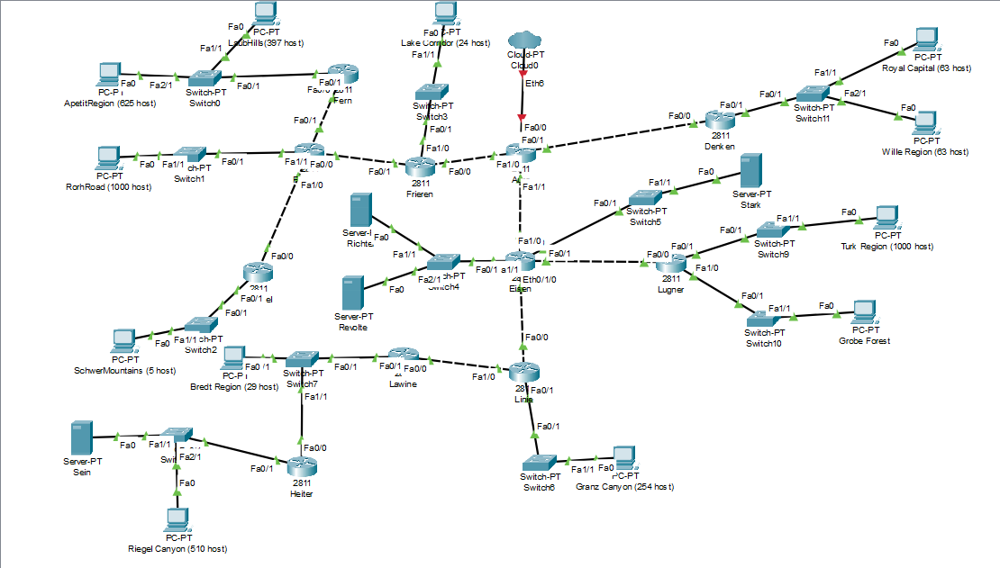

## **_Subnetting_**
Berbeda dengan metode subnetting sebelumnya. Metode ini mengelompokkan subnet dari jarak paling jauh terlebih dahulu.Pengelompokkan ini dilakukan hingga menjadi suatu pengelompokan yang secara meluruh seperti hierarchical clustering.

Berikut adalah hasil dari subnetting kelompok kami:

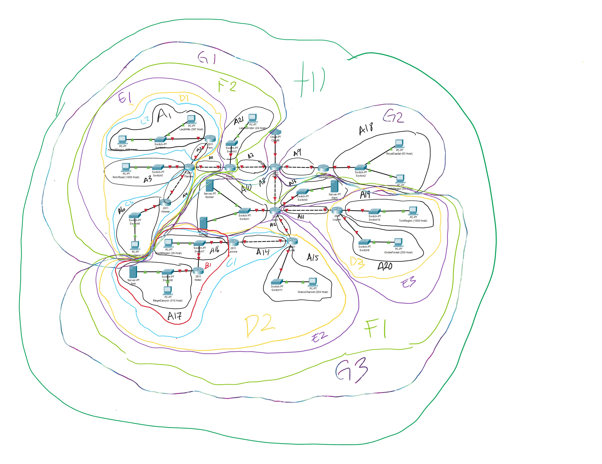

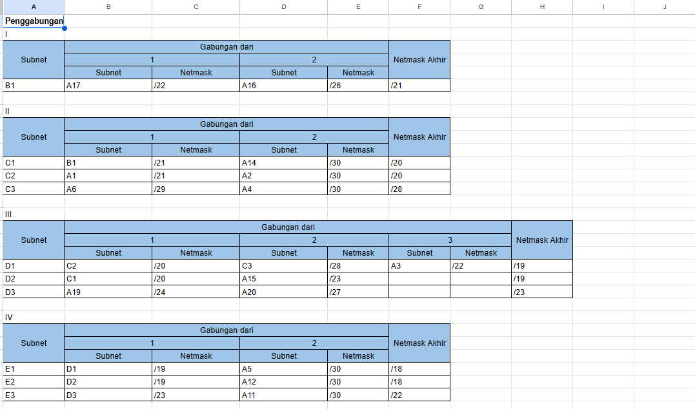

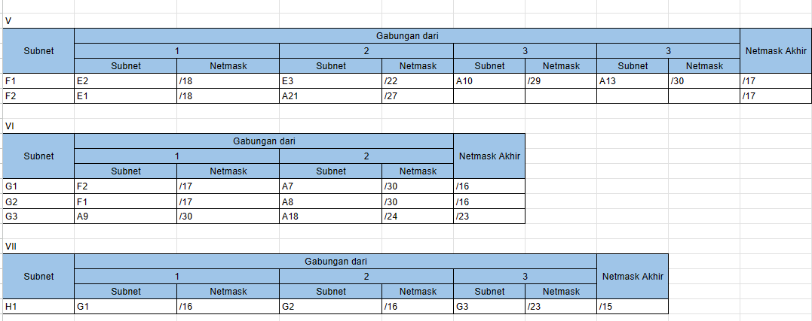


Selanjutnya, kita dapat melakukan konfigurasi interface pada setiap client, router, dan server. Sebagai contoh, kita melakukan konfigurasi untuk router Aura untuk FastEthernet 0/1.


Disini kita dapat langsung memasukkan konfigurasi IP dan Subnet Mask yang sudah ditetapkan sebelumnya. Hal ini dilakukan untuk semua-nya berdasarkan jalur yang sudah ditetapkan dari topologi yang tertera diatas.


## **__Routing__**
Proses routing dapat dilakukan dengan mengkonfigurasi :
- Router - bagian Routing
- Server dan Client - bagian Desktop -> IP Configuration.

Sebagai contoh untuk Routing IP Router Flamme.

Pada Router Flamme, kita perlu mengkonfigurasi kelompok-kelompok yang perlu di gateaway dari router ini menuju router pusat (Aura).

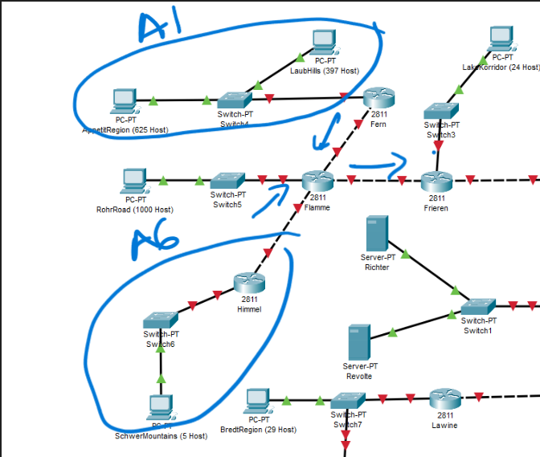

Terlihat bahwa terdapat 2 kelompok subnet yang perlu dikonfigurasi pada router ini, yaitu subnet A6 dan A1, karena kelompok subnet tersebut dipisahkan oleh sebuah router.

Hal ini dapat dilakukan di konfigurasi Flamme.

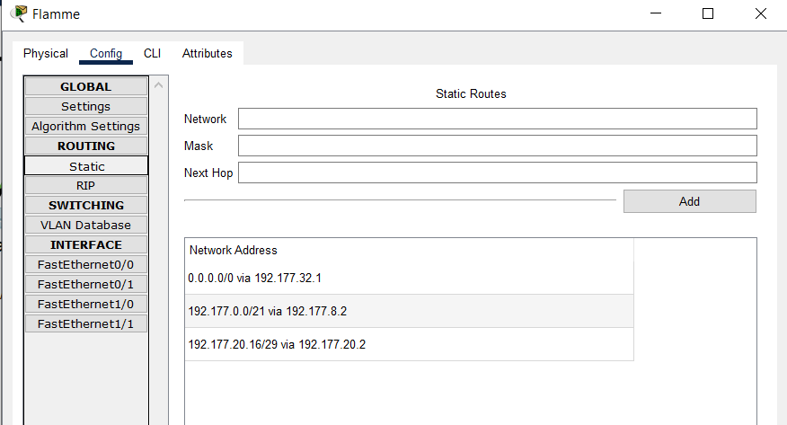

- 192.177.0.0/21 via 192.177.8.2 (Flamme -> A6)
- 192.177.20.16/29 via 192.177.20.2 (Flamme -> A1)
- 0.0.0.0/0 via 192.177.32.1 (Flamme -> Frieren)

Setelah ini, kita juga perlu mengkonfigurasi subnet-subnet agar terhubung dengan router Flamme.

- Pada Client SchwerMountain
Kita perlu menentukan gateway yang dapat terhubung ke router Flamme, yaitu melalui router Himmel.

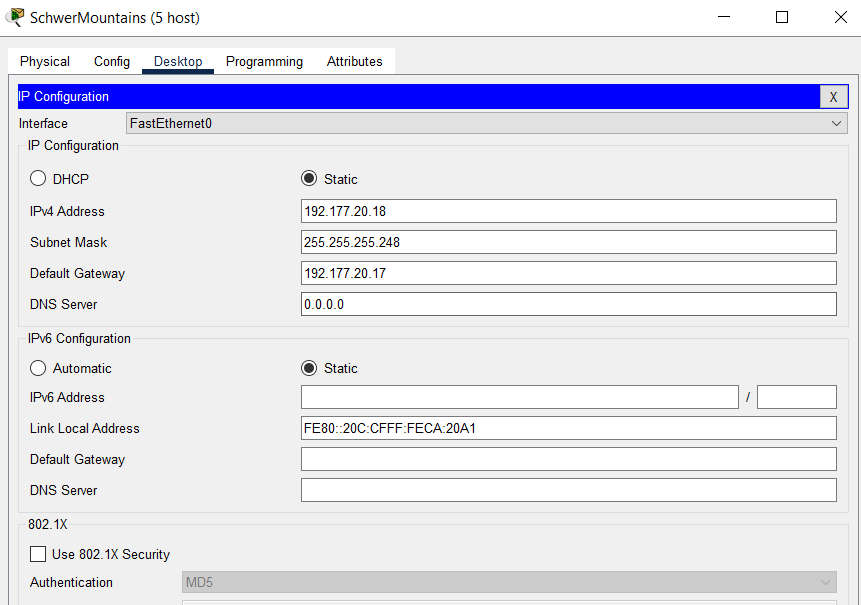


Dan pada Himmel, kita juga harus menerukan paket ini kepada router Flamme dengan konfigurasi secara berikut.

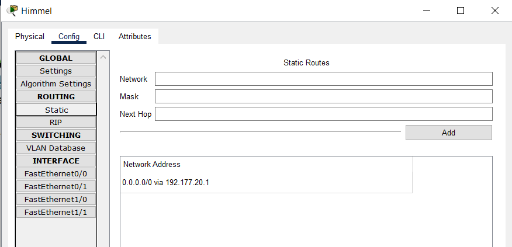

Dengan konfigurasi yang telah dilakukan, paket dapat dikirim secara vice-versa.

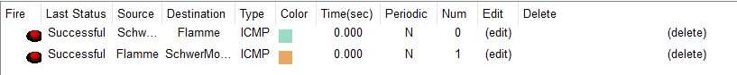

Cara ini dilanjutkan hingga semua router, client, dan server terhubung.

# **Kendala Saat Pengerjaan**

- Banyaknya _final project_ dan ujian lain sehingga mengakibatkan waktu untuk mengerjakan praktikum lebih sedikit. 

- Kurangnya pemahaman terkait _subnetting_ dan _routing_ sehingga membutuhkan waktu lebih untuk mengerjakan praktikum.

- Kurang teliti saat proses _routing_ sehingga terjadi banyak error (konflik antara IP dan Subnet).

# **End of The Line**

```c
#include <stdio.h>

int main(){
    printf("Thank you!");
}
```
